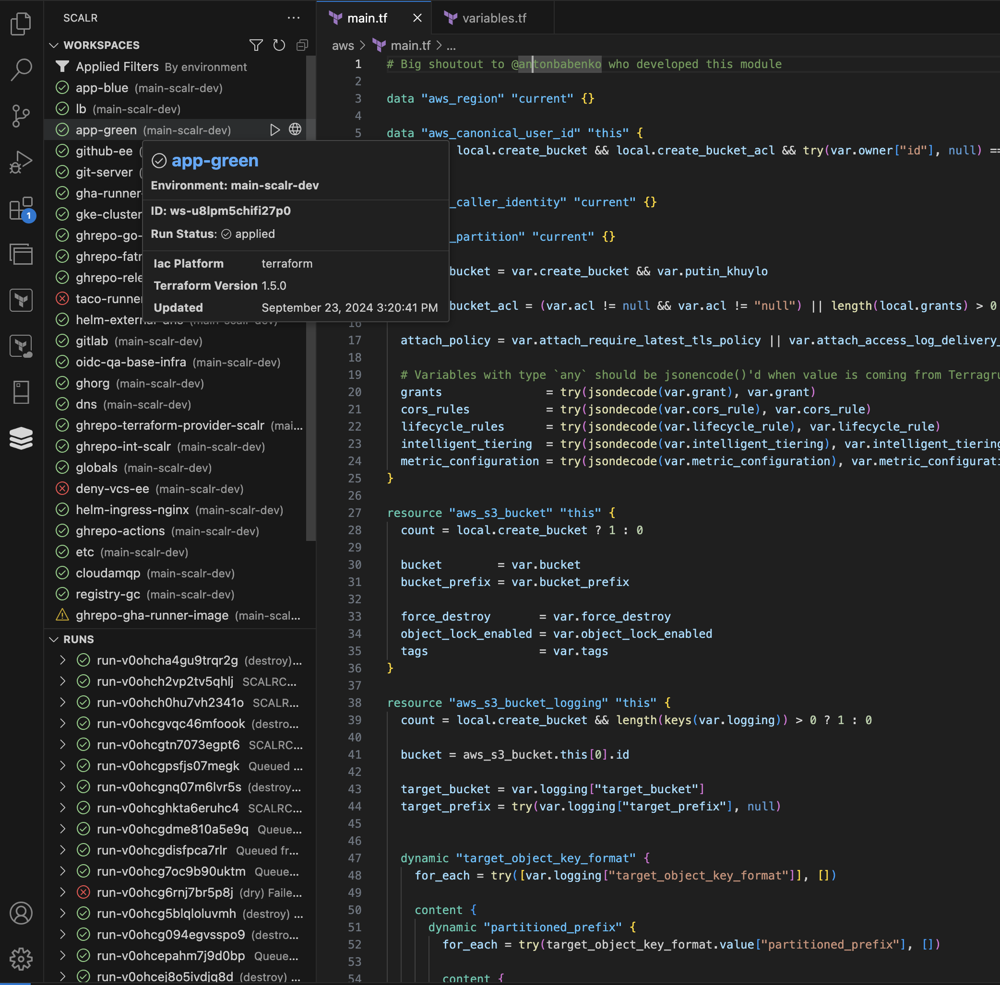

# Scalr VS Code Extension

## Overview

The Scalr VS Code Extension is a tool designed to streamline your Opentofu/Terraform workflows by integrating Scalr directly into your Visual Studio Code environment. This extension allows you to manage workspaces, monitor runs, and access critical information about your infrastructure—without leaving your code editor.



## Disclaimer: Early Stages

Please Note: This extension is currently in its early stages of development. While it includes core functionalities, you may encounter bugs or incomplete features. We welcome your feedback and contributions to help improve and stabilize the extension.

## Features

| Feature              | Description                                                                                                  |
| -------------------- | ------------------------------------------------------------------------------------------------------------ |
| Workspace Management | View a comprehensive list of available workspaces for logged-in users.                                       |
| Run Overview         | Access a list of all runs, with the ability to filter runs specific to a workspace.                          |
| Run triggering       | Preview, Apply, or Destroy infrastructure in the selected workspace and review changes right in the VS Code. |
| Detailed Information | Get quick access to general information about any workspace or run.                                          |
| Plan/Apply Output    | Read the output from Terraform plan and apply operations directly within VS Code.                            |
| Scalr UI Integration | Convenient links provide quick navigation to the corresponding sections of the Scalr web UI.                 |

### Configuring an HTTP Proxy

If your environment requires using an HTTP proxy to connect to external services, you can configure the VS Code extension to use a proxy by following these steps:

1. **Open Settings**:  
   - Go to the **Settings** tab in VS Code.  
   - Alternatively, you can open the command palette (`Ctrl+Shift+P` or `Cmd+Shift+P` on macOS) and search for `Preferences: Open Settings (UI)`.

2. **Search for Proxy Settings**:  
   - In the Settings search bar, type `proxy`.

3. **Configure Proxy**:  
   - **HTTP Proxy**: Enter your HTTP proxy URL under `Proxy > HTTP: Proxy`.
   - **HTTPS Proxy**: If your proxy also handles HTTPS traffic, enter it under `Proxy > HTTPS: Proxy`.
   - **Proxy Strict SSL**: Toggle `Proxy > Strict SSL` if your proxy uses a self-signed certificate.

4. **Configure the Extension**:  
   - If the extension needs to use the proxy for specific API calls, ensure it respects the global proxy settings in VS Code. You can also configure proxy settings directly in the extension by setting the following in your `settings.json`:
   
   ```json
   "http.proxy": "http://<proxy-url>:<port>",
   "http.proxyStrictSSL": false
   ```

5. **Restart VS Code**:  
   After configuring your proxy, restart VS Code to ensure the settings are applied.

For more advanced proxy configurations, refer to the official [VS Code documentation](https://code.visualstudio.com/docs/setup/network#_proxy-server-support).

## Installation

### From the VS Code Marketplace

1. Open Visual Studio Code.
2. Navigate to the Extensions view by clicking on the Extensions icon in the Activity Bar on the side of the window.
3. Search for `Scalr` in the search box.
4. Click **Install** to install the extension.

### Building Locally

If you want to install dependencies and build the extension locally, follow these steps:

> ℹ️ **Prerequisites**:
>
> -   **Node.js**: Ensure you have Node.js installed. You can download it from [nodejs.org](https://nodejs.org/).
> -   **npm**: Make sure you have npm (comes with Node.js).

#### Steps to Build Locally

1. **Clone the Repository**:

    ```bash
    git clone https://github.com/{your-username}/scalr-vscode.git
    cd scalr-vscode
    ```

2. **Install Dependencies**:

    ```bash
    npm install
    ```

3. **Run the Extension**:
    - Open the project folder in Visual Studio Code.
    - Press `F5` to open a new VS Code window with your extension loaded.

## Usage

| Command           | How to?                                                                                  |
| ----------------- | ---------------------------------------------------------------------------------------- |
| Login             | After installing, you can log in to your Scalr account through the extension.            |
| View Workspaces   | Click on the Scalr icon in the sidebar to view your available workspaces.                |
| Run Management    | Select a workspace to see all associated runs or access the list of all runs.            |
| Access Details    | Click on a workspace or run to view detailed information, including metadata and status. |
| Plan/Apply Output | Select a run to view the output from Terraform plan and apply operations.                |
| UI Links          | Use the provided links to navigate quickly to the Scalr UI for deeper management tasks.  |

## Contributing

Contributions are welcome! Please follow these steps to contribute:

1. Fork the repository.
2. Create a new branch (`git checkout -b feature-branch-name`).
3. Make your changes.
4. Commit your changes (`git commit -am 'Add new feature'`).
5. Push to the branch (`git push origin feature-branch-name`).
6. Open a pull request in the [scalr-vscode](https://github.com/Scalr/scalr-vscode) repository.

## License

This project is licensed under the MPL-2.0 License. See the [LICENSE](LICENSE) file for details.

## Support

For any issues or feature requests, please open an issue on our [GitHub Issues](https://github.com/Scalr/scalr-vscode/issues) page.
